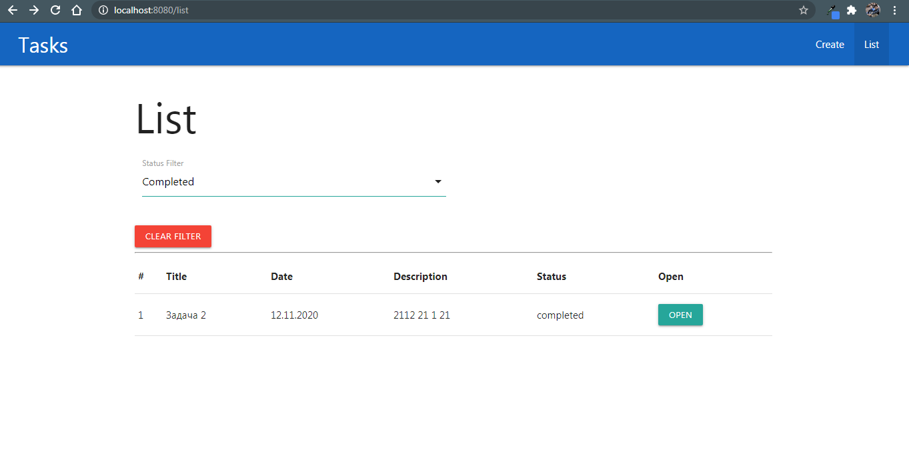

# TodoList Vue-CLI 

Шаги, чтобы подготовить приложение:
  1. Скачайте архив;
  2. Распакуйте его на вашем компьютере;
  3. Откройте содержимое папки с помошью текстового редактора (VS Code, WebStorm или любого другого на Ваш выбор)
  4. С помощью терминала войдите в папку, введя команду 
  ```
  $ cd todo-list
  ```
  5. После этого, чтобы установить компоненты для правильной работы приложения также в терминале введите команду 
  ```
  $ npm install
  ```
Для того, чтобы открыть чат в режиме разработки используйте команду 
```
$ npm run serve
```
Когда Nuxt выполнит свою работу перейдите по [ссылке](http://localhost:8080) и можете начать свое общение.

Для запуска сборки в режиме продакшена:
```
$ npm run build
```

Пример выполненной задачи:

Если возникли сложности, пишите на почту: **Gaemvlad@gmail.com**